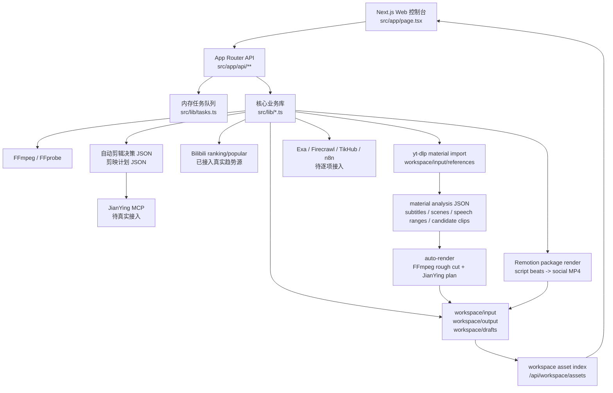

# 系统架构与数据流

## 当前架构

## 目录职责

| 路径 | 职责 |
|---|---|
| `src/app/page.tsx` | 主控制台 UI，左侧全链路模块可点击，右侧执行真实 API |
| `src/app/globals.css` | 控制台视觉与交互样式 |
| `src/app/api/tasks/route.ts` | 查询任务列表或单个任务 |
| `src/app/api/workspace/assets/route.ts` | 扫描 workspace，返回素材、分析 JSON、输出视频和剪映计划索引 |
| `src/app/api/video/*/route.ts` | FFmpeg 视频信息、裁剪、合并、分割、格式目录 |
| `src/app/api/auto/*/route.ts` | 自动计划、自动渲染、自动模拟剪辑 |
| `src/app/api/creator/*/route.ts` | 创作者全链路方案与就绪度检查 |
| `src/app/api/trend/report/route.ts` | B站真实趋势情报，返回完成后的 task |
| `src/app/api/materials/import/route.ts` | 公开视频参考素材导入，调用 yt-dlp 并生成 manifest |
| `src/app/api/materials/analyze/route.ts` | 素材分析，生成字幕片段、场景变化、静音/有声段和候选切点 |
| `src/app/api/remotion/render/route.ts` | 将脚本节拍渲染成可发布的 Remotion 包装 MP4 |
| `src/app/api/integrations/route.ts` | 成熟工具集成目录 |
| `src/app/api/mcp/config/route.ts` | MCP 配置建议 |
| `src/lib/ffmpeg.ts` | FFmpeg/FFprobe 封装 |
| `src/lib/platform-variants.ts` | 平台比例视频导出，生成抖音/快手/B站/方版发布视频 |
| `src/lib/auto-plan.ts` | 自动剪辑决策生成 |
| `src/lib/auto-render.ts` | 自动粗剪执行与剪映计划生成 |
| `src/lib/creator-suite.ts` | 热点、脚本、素材、发布、复盘方案生成 |
| `src/lib/creator-toolkit.ts` | 全链路工具目录 |
| `src/lib/integrations.ts` | 外部工具集成目录 |
| `src/lib/python-tools.ts` | Python/CLI 工具解释器选择与模块调用封装 |
| `src/lib/remotion-render.ts` | Remotion bundle、composition 选择和 MP4 渲染封装 |
| `src/lib/schemas.ts` | Zod 输入校验 schema |
| `src/lib/tasks.ts` | 内存任务管理 |
| `src/lib/workspace-assets.ts` | 工作区资产分类与索引 |
| `src/lib/trend/*` | B站趋势源、榜单映射、评分、LLM 分析与报告组装 |
| `src/lib/materials/yt-dlp.ts` | yt-dlp 命令构造、执行、素材 manifest 生成 |
| `src/lib/materials/analysis.ts` | 素材 manifest/视频分析、字幕/Whisper 转写、FFmpeg/PySceneDetect 场景检测、Auto-Editor 预览、候选切点 |
| `src/remotion/*` | Remotion 视频组件、composition 注册和入口 |
| `workspace/input` | 用户素材、模拟素材、待处理视频 |
| `workspace/output` | 输出视频、临时片段、发布素材 |
| `workspace/drafts` | 自动剪辑决策、剪映草稿计划、创作方案 JSON |

## 数据流

1. 用户在 UI 选择模块并提交参数。
2. API route 使用 Zod 校验输入。
3. API 创建任务，开始执行本地处理。
4. 处理过程写入任务日志和进度。
5. FFmpeg 或计划生成器输出文件到 `workspace/output` 和 `workspace/drafts`。
6. UI 轮询 `/api/tasks` 展示任务状态、结果和错误。

## 已验证闭环

趋势情报流程已经跑通：

1. 调用 B站公开排行榜，综合榜单失败时 fallback 到热门接口。
2. 将真实播放、点赞、收藏、评论、弹幕等指标映射为 `TrendItem`。
3. 计算互动率、涨速、潜力分、置信度。
4. 可选调用 LLM 生成爆火逻辑、共性套路和选题卡。当前默认 `LLM_PROVIDER=deepseek`，并保留 Doubao Ark、Claude gateway、GPT gateway 扩展位。
5. LLM 未配置、失败或超时时，降级返回真实榜单和确定性评分。
6. UI 展示榜单、潜力分、置信度、AI 状态和任务结果。

自动模拟剪辑流程已经跑通：

1. 创建测试视频。
2. 生成自动剪辑决策 JSON。
3. 按决策裁剪 3 段视频。
4. 合并为粗剪 MP4。
5. 生成 JianYing plan JSON。
6. UI 任务列表展示成功结果。

素材导入流程已经接入：

1. UI 在“联网素材”模块提交公开视频链接。
2. `/api/materials/import` 校验 URL、质量、字幕、输出目录。
3. `yt-dlp` 下载授权素材、封面、字幕和 `info.json`。
4. 生成 `workspace/input/references/*/manifest.json`。
5. 后续 ASR、场景检测、自动剪辑统一读取该 manifest。

素材分析流程已经接入：

1. 支持输入 `manifestPath`、`materialDir` 或 `videoPath`。
2. 自动读取最新 manifest 或目录内最新视频。
3. 优先解析 SRT/VTT 字幕；按配置可调用 faster-whisper 生成 transcript segments。
4. 按配置使用 PySceneDetect 或 FFmpeg scene detect 生成场景变化。
5. 使用 FFmpeg silencedetect 生成静音段，并反推出可粗剪的有声段。
6. 可调用 Auto-Editor preview 获取自动剪辑预估结果。
7. 生成 candidate clips 并保存到 `workspace/drafts/material-analysis-*.json`。

分析结果粗剪流程已经接入：

1. `/api/auto/render` 支持 `analysisPath`。
2. `analysisPath` 可传具体 JSON 或 `workspace/drafts` 目录。
3. 系统从 `material-analysis-*.json` 读取 primary video 和 candidate clips。
4. 复用 FFmpeg clip/merge 生成 rough cut MP4。
5. 同步输出 JianYing plan JSON，后续可继续映射到真实剪映 MCP 草稿。

Remotion 包装渲染流程已经接入：

1. UI 从脚本生成结果中读取标题、开场钩子和节拍。
2. `/api/remotion/render` 校验脚本结构、比例、时长和输出文件名。
3. 服务端 bundle `src/remotion/index.ts`，选择竖版或横版 composition。
4. `@remotion/renderer` 渲染 H.264 MP4 到 `workspace/output/remotion`。
5. task 记录输出路径、composition、分辨率、帧率和时长，UI 可继续轮询展示结果。

## 外部工具接入方式

外部工具按三类接入：

- API 型：Exa、Firecrawl、TikHub、Postiz、n8n。通过 `.env.example` 中的 Key/URL 配置。
- CLI 型：yt-dlp、faster-whisper、PySceneDetect、Auto-Editor、social-auto-upload。通过本地安装路径或子进程调用。
- MCP 型：JianYing MCP、Video Clip MCP。通过 MCP 配置和工具映射调用。

## 设计约束

- 任何外部输入都要经 Zod schema 校验。
- 所有本地文件路径都通过 `resolveLocalPath` 处理。
- 长任务不阻塞 UI，统一走 task id。趋势报告属于短任务，在 API 请求内完成并返回最终 task，避免 Next route 后台任务挂起。
- 外部发布必须先有 dry-run，不允许直接一键真发。
- 工作区输出要可追溯：每个计划、粗剪、草稿都应落盘。
