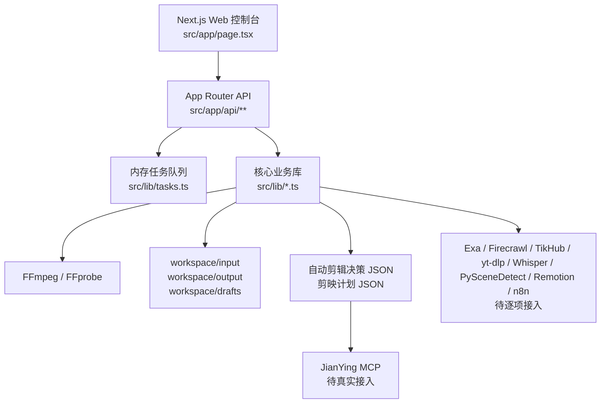

# 系统架构与数据流

## 当前架构

## 目录职责

| 路径 | 职责 |
|---|---|
| `src/app/page.tsx` | 主控制台 UI，左侧全链路模块可点击，右侧执行真实 API |
| `src/app/globals.css` | 控制台视觉与交互样式 |
| `src/app/api/tasks/route.ts` | 查询任务列表或单个任务 |
| `src/app/api/video/*/route.ts` | FFmpeg 视频信息、裁剪、合并、分割、格式目录 |
| `src/app/api/auto/*/route.ts` | 自动计划、自动渲染、自动模拟剪辑 |
| `src/app/api/creator/*/route.ts` | 创作者全链路方案与就绪度检查 |
| `src/app/api/integrations/route.ts` | 成熟工具集成目录 |
| `src/app/api/mcp/config/route.ts` | MCP 配置建议 |
| `src/lib/ffmpeg.ts` | FFmpeg/FFprobe 封装 |
| `src/lib/auto-plan.ts` | 自动剪辑决策生成 |
| `src/lib/auto-render.ts` | 自动粗剪执行与剪映计划生成 |
| `src/lib/creator-suite.ts` | 热点、脚本、素材、发布、复盘方案生成 |
| `src/lib/creator-toolkit.ts` | 全链路工具目录 |
| `src/lib/integrations.ts` | 外部工具集成目录 |
| `src/lib/schemas.ts` | Zod 输入校验 schema |
| `src/lib/tasks.ts` | 内存任务管理 |
| `workspace/input` | 用户素材、模拟素材、待处理视频 |
| `workspace/output` | 输出视频、临时片段、发布素材 |
| `workspace/drafts` | 自动剪辑决策、剪映草稿计划、创作方案 JSON |

## 数据流

1. 用户在 UI 选择模块并提交参数。
2. API route 使用 Zod 校验输入。
3. API 创建任务，开始执行本地处理。
4. 处理过程写入任务日志和进度。
5. FFmpeg 或计划生成器输出文件到 `workspace/output` 和 `workspace/drafts`。
6. UI 轮询 `/api/tasks` 展示任务状态、结果和错误。

## 已验证闭环

自动模拟剪辑流程已经跑通：

1. 创建测试视频。
2. 生成自动剪辑决策 JSON。
3. 按决策裁剪 3 段视频。
4. 合并为粗剪 MP4。
5. 生成 JianYing plan JSON。
6. UI 任务列表展示成功结果。

## 外部工具接入方式

外部工具按三类接入：

- API 型：Exa、Firecrawl、TikHub、Postiz、n8n。通过 `.env.example` 中的 Key/URL 配置。
- CLI 型：yt-dlp、faster-whisper、PySceneDetect、Auto-Editor、social-auto-upload。通过本地安装路径或子进程调用。
- MCP 型：JianYing MCP、Video Clip MCP。通过 MCP 配置和工具映射调用。

## 设计约束

- 任何外部输入都要经 Zod schema 校验。
- 所有本地文件路径都通过 `resolveLocalPath` 处理。
- 长任务不阻塞 UI，统一走 task id。
- 外部发布必须先有 dry-run，不允许直接一键真发。
- 工作区输出要可追溯：每个计划、粗剪、草稿都应落盘。
